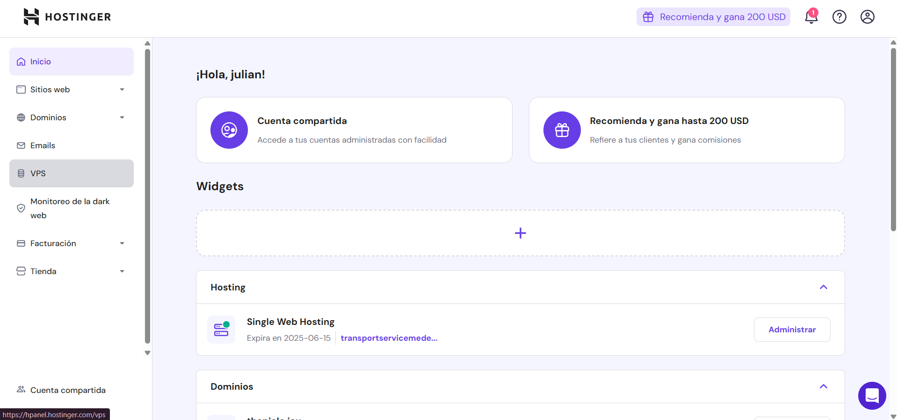

# **Deploying a Next.js Application on Hostinger (Using a VPS)**

- **VPS (Virtual Private Server):** A virtual server that behaves like a dedicated server. The virtual server is hosted on a physical machine through virtualization, meaning a virtual server is hosted on a dedicated server that shares its resources.

Once you have acquired a VPS on Hostinger, follow these steps:

## 1- Connect to Your VPS via SSH from Your Terminal
**SSH (Secure Shell):** A secure protocol that allows remote access to servers. There are two main authentication methods:

- **Password Authentication**: You enter a password each time you access the server.
- **SSH Key Authentication**: A pair of cryptographic keys (public and private) is used to authenticate automatically without entering a password.

Using SSH keys is preferred because it provides greater **security, automation, and convenience** in authentication.

### _**Why Use SSH Keys Instead of Passwords?**_

**Enhanced Security:** Passwords can be vulnerable to:
- Brute-force attacks.
- Keyloggers.
- Credential theft in phishing attacks.

SSH keys, on the other hand, use **asymmetric cryptography**, making them virtually impossible to crack via brute-force attacks.

**Automation and Ease of Use**
- Allows access without typing the password every time.
- Ideal for automating tasks using **scripts**.
- Can be used with an SSH agent to manage multiple connections without re-entering the password.

**Controlled Access**
- You can share only the public key with servers without compromising the private key.
- You can revoke access by removing the public key from the server without changing credentials.

---

### **1.1 Generating and Configuring SSH Keys**
#### **Generate an SSH Key Pair**
Run the following command in your terminal (Linux, macOS, or Windows WSL):

```bash
ssh-keygen -t rsa -b 4096 -C "your_email@example.com"
```

Explanation:
- `-t rsa`: Specifies the **RSA** algorithm.
- `-b 4096`: Generates a **4096-bit key** (more secure than 2048-bit).
- `-C "your_email@example.com"`: Adds an identifier comment.

When prompted where to save the key, press **Enter** to use the default location:

```
Enter file in which to save the key (/home/user/.ssh/id_rsa):
```

Optionally, you can set a passphrase for additional security.

### **1.2 Copy the Public Key to the Server (Option 1)**
If you already have access to the server via password, use the following command to automatically copy the public key:

```bash
ssh-copy-id user@SERVER_IP
```

If `ssh-copy-id` is not available, manually copy the key:

```bash
cat ~/.ssh/id_rsa.pub
```

Copy the output and add it to the `~/.ssh/authorized_keys` file on the server:

```bash
echo "public_key" >> ~/.ssh/authorized_keys
chmod 600 ~/.ssh/authorized_keys
```

### **1.3 Copy the Public Key to the Server (Option 2)**
On the Hostinger panel, click **VPS** on the left side.

You will see your VPS instances. Click **Manage**.

After clicking **Manage**, more options appear on the left. Click **Settings**.

Go to the **SSH Keys** section to add your key.

Click **Add SSH Key**. A panel will open where you must paste the public key. To view and copy your public key, use the command:
```bash
cat ~/.ssh/id_rsa.pub
```

Finally, paste the key into the panel and save.

### **3.3 Verify and Test the Connection**
Now, try connecting without using a password:

```bash
ssh user@SERVER_IP
```

If the setup is correct, you should log in without being prompted for a password.

---

## **4. Advanced Configuration: Using the ~/.ssh/config File**
To further simplify access, create a local SSH configuration file:

```bash
nano ~/.ssh/config
```

Add the following:

```ini
Host my-server
    HostName SERVER_IP
    User user
    IdentityFile ~/.ssh/id_rsa
```

Save and close the file (`CTRL + X`, then `Y`, and **Enter**). Now, you can connect with:

```bash
ssh my-server
```

---

## **5. Additional Security: Protecting the Private Key**
To prevent misuse of the private key:

- **Never share** your private key (`id_rsa`).
- Use secure permissions:
  ```bash
  chmod 600 ~/.ssh/id_rsa
  ```
- Enable an **SSH agent** to manage keys in active sessions:
  ```bash
  eval $(ssh-agent -s)
  ssh-add ~/.ssh/id_rsa
  ```

---

## **6. Conclusion**
Using SSH keys for authentication on remote servers is a best practice due to its high security, ease of use, and flexibility. By following these steps, you can efficiently configure and manage SSH access.

---