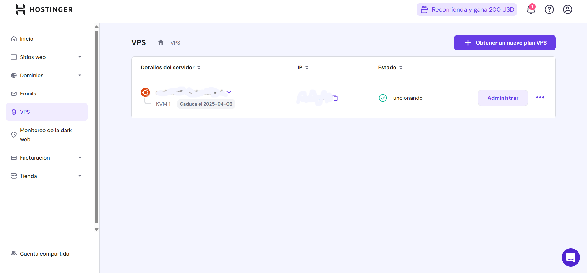
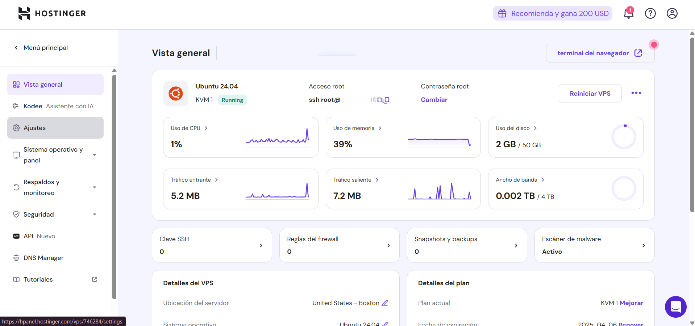

# **Despliegue de aplicación en Hostinguer hecha en Next JS (Usando una VPS)**
- **VPS (Virtual Private Server):** Es un servidor virtual que parece un servidor dedicado. El servidor virtual esta alojado en una maquina fisica mediante virtualizacion, O sea un servidor virtual está alojado en un servidor dedicado que comparte sus recursos.

Una vez adquirido una VPS en hostinguer realizamos los siguientes pasos:
## 1- Conectarnos desde nuestra terminal via SSH a nuestra VPS.
**SSH (Secure Shell):** Es un protocolo seguro que permite el acceso remoto a servidores. Para autenticarse, existen dos métodos principales:

- **Autenticación por contraseña**: Se ingresa una contraseña cada vez que se accede al servidor.
- **Autenticación con clave SSH**: Se usa un par de claves criptográficas (pública y privada) para autenticar automáticamente al usuario sin necesidad de ingresar una contraseña.

El uso de claves SSH es preferido porque ofrece mayor **seguridad, automatización y conveniencia** en la autenticación.

### _**¿Por qué usar claves SSH en lugar de contraseñas?**_

**Mayor Seguridad:** Las contraseñas pueden ser vulnerables a:
- Ataques de fuerza bruta.
- Keyloggers.
- Robo de credenciales en ataques de phishing.

En cambio, las claves SSH utilizan **criptografía asimétrica**, lo que hace que sean prácticamente imposibles de descifrar mediante ataques de fuerza bruta.

**Automatización y Facilidad de Uso**
- Permite acceder sin necesidad de escribir la contraseña en cada conexión.
- Ideal para la automatización de tareas mediante **scripts**.
- Se pueden usar junto con un agente SSH para gestionar múltiples conexiones sin volver a ingresar la contraseña.

**Acceso Controlado**
- Se puede compartir solo la clave pública con servidores sin comprometer la clave privada.
- Se puede revocar el acceso eliminando la clave pública del servidor, sin necesidad de cambiar credenciales.

---

### **1.1 Generación y Configuración de Claves SSH**
#### **Generar un Par de Claves SSH**
Ejecuta el siguiente comando en tu terminal (Linux, macOS o Windows WSL):

```bash
ssh-keygen -t rsa -b 4096 -C "tu_correo@example.com"
```

Explicación:
- `-t rsa`: Especifica el algoritmo **RSA**.
- `-b 4096`: Genera una clave de **4096 bits** (más segura que 2048).
- `-C "tu_correo@example.com"`: Agrega un comentario identificador.

Cuando el sistema pregunte dónde guardar la clave, presiona **Enter** para usar la ubicación predeterminada:

```
Enter file in which to save the key (/home/usuario/.ssh/id_rsa):
```

Opcionalmente, puedes establecer una contraseña para mayor seguridad.

### **1.2 Copiar la Clave Pública al Servidor (Opción 1)**
Si ya tienes acceso al servidor mediante contraseña, usa el siguiente comando para copiar la clave pública automáticamente:

```bash
ssh-copy-id usuario@IP_DEL_SERVIDOR
```

Si `ssh-copy-id` no está disponible, copia la clave manualmente:

```bash
cat ~/.ssh/id_rsa.pub
```

Copia la salida y agrégala al archivo `~/.ssh/authorized_keys` en el servidor:

```bash
echo "clave_publica" >> ~/.ssh/authorized_keys
chmod 600 ~/.ssh/authorized_keys
```
### **1.3 Copiar la Clave Pública al Servidor (Opción 2)**
Ubicados en nuestro panel de Hostinguer al lado izquiero damos click a la opcion VPS.

Nos aparecerá nuestras VPS. Damos click en administrar.

Al dar click en administrar al lado izquierdo saldran nuevas opciones, damos click en ajustes.

Vamos a la seccion de claves SSH para agregar nuestra clave.

Damos en agregar clave SSH. Se abre un panel donde debemos pegar la clave publica que generamos. para ver la clave publica y poderla copiar usamos el comando: 
```bash
cat ~/.ssh/id_rsa.pub
```

Finalmente la pegamos en el panel y guardamos.
### **3.3 Verificar y Probar la Conexión**
Ahora, intenta conectarte sin usar una contraseña:

```bash
ssh usuario@IP_DEL_SERVIDOR
```

Si la configuración es correcta, deberías acceder sin que se te solicite una contraseña.

---

## **4. Configuración Avanzada: Uso del Archivo ~/.ssh/config**
Para simplificar aún más el acceso, puedes crear un archivo de configuración SSH local:

```bash
nano ~/.ssh/config
```

Añade lo siguiente:

```ini
Host mi-servidor
    HostName IP_DEL_SERVIDOR
    User usuario
    IdentityFile ~/.ssh/id_rsa
```

Guarda y cierra el archivo (`CTRL + X`, luego `Y` y `Enter`). Ahora puedes conectarte con:

```bash
ssh mi-servidor
```

---

## **5. Seguridad Adicional: Protección de la Clave Privada**
Para evitar el uso indebido de la clave privada:

- **No compartas nunca** tu clave privada (`id_rsa`).
- Usa permisos seguros:
  ```bash
  chmod 600 ~/.ssh/id_rsa
  ```
- Habilita un **agente SSH** para gestionar claves en sesiones activas:
  ```bash
  eval $(ssh-agent -s)
  ssh-add ~/.ssh/id_rsa
  ```

---

## **6. Conclusión**
El uso de claves SSH para autenticación en servidores remotos es una práctica recomendada por su alta seguridad, facilidad de uso y flexibilidad. Siguiendo estos pasos, puedes configurar y gestionar accesos SSH de manera eficiente.

---

